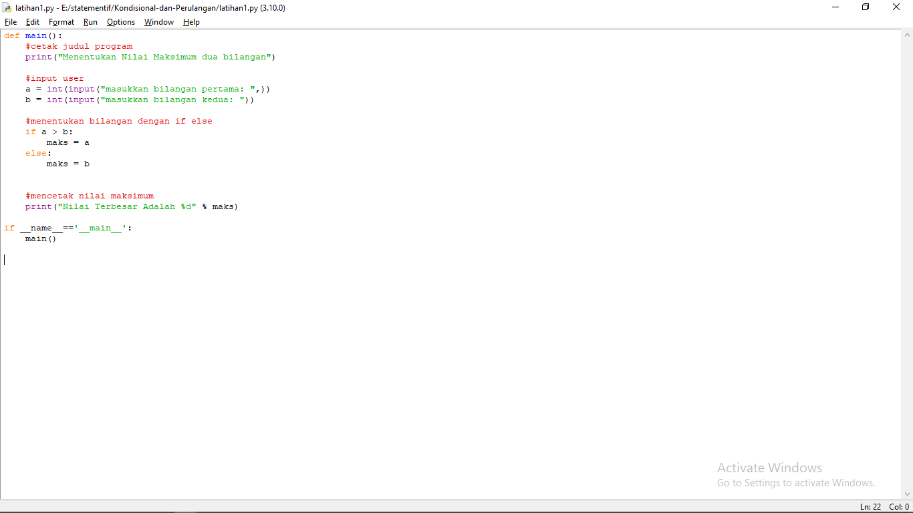
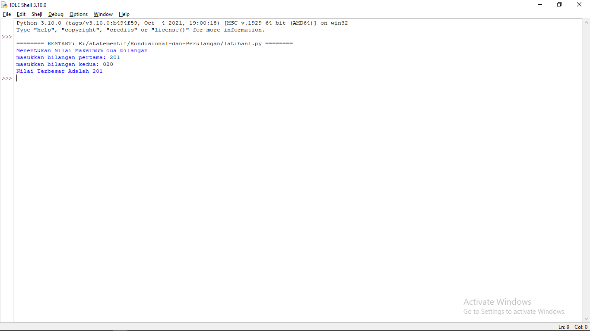
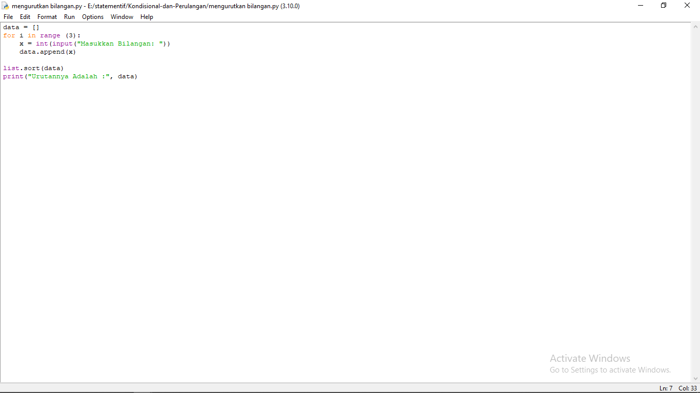
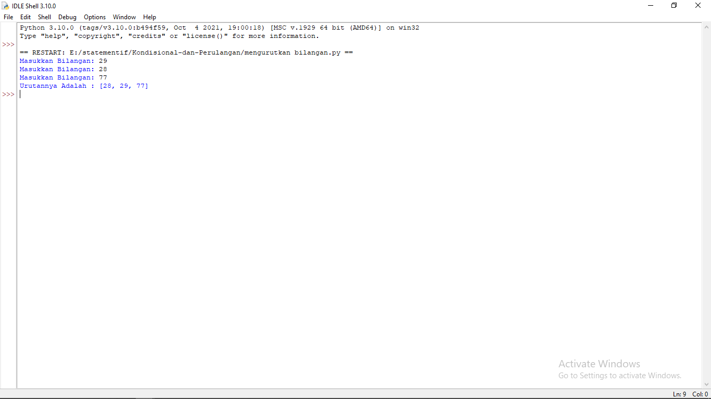
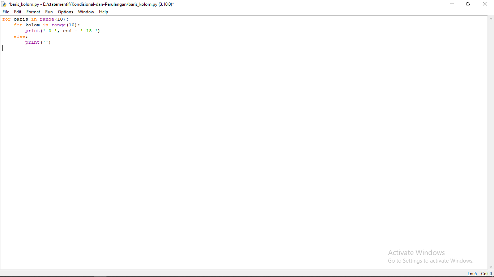
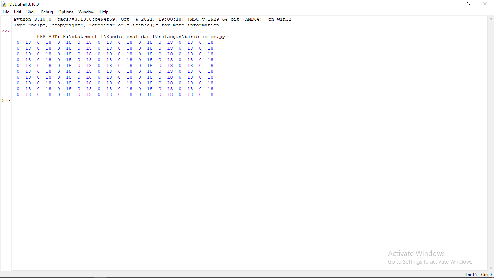
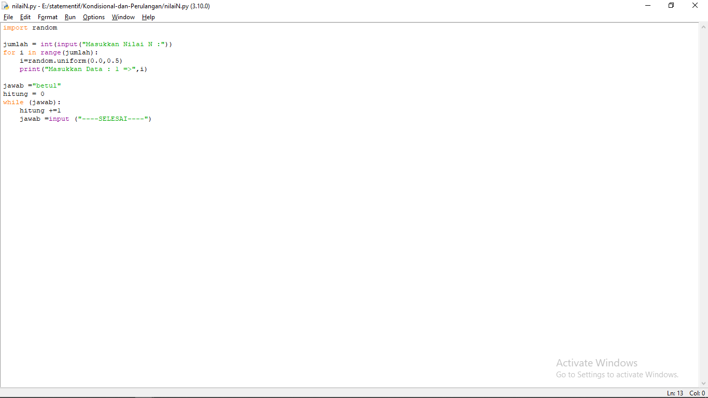
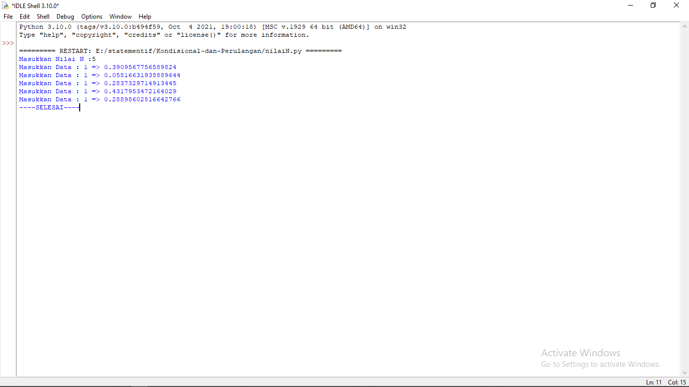

# Kondisional-dan-Perulangan
# Latihan1.py

# Soal Latihan1.py

	*Latihan 1
Buat program sederhana dengan input 2 buah bilangan, kemudian tentukan bilangan terbesar dari kedua bilangan tersebut menggunakan statement if.

	def main():
	#cetak judul program
	print("Menentukan Nilai Maksimum dua bilangan")

	#input user
	a = int(input("masukkan bilangan pertama: ",))
	b = int(input("masukkan bilangan kedua: "))

	#menentukan bilangan dengan if else
	if a > b:
		maks = a
	else:
		maks = b

	#mencetak nilai maksimum
	print("Nilai Terbesar Adalah %d" % maks)
	if __name__=='__main__':
	main()

#CONTOH INPUTNYA

#Tampilan Setelah Di RUN

#Mengurutkan Bilangan
	
	data = []
		for i in range (3):
	x = int(input("Masukkan Bilangan"))
	data.append(x)

	list.sort(data)
	print("Urutannya Adalah :", data)

#Contoh Inputnya

#TAMPILAN SETELAH DI RUN

#BARIS DAN KOLOM

	for baris in range(10):
		for kolom in range(10):
			print(' 0 ', end = ' 18 ')
	else:
		print('')

#CONTOH INPUTNYA

#TAMPILAN SETELAH DI RUN

#nilaiN

	import random

	jumlah = int(input("Masukkan Nilai N :"))
	for i in range(jumlah):
    i=random.uniform(0.0,0.5)
    print("Masukkan Data : 1 =>",i)

	jawab ="betul"
	hitung = 0
	while (jawab):
    	hitung +=1
    	jawab =input ("----SELESAI----")

#CONTOH INPUTNYA

#TAMPILAN SETELAH DI RUN

#